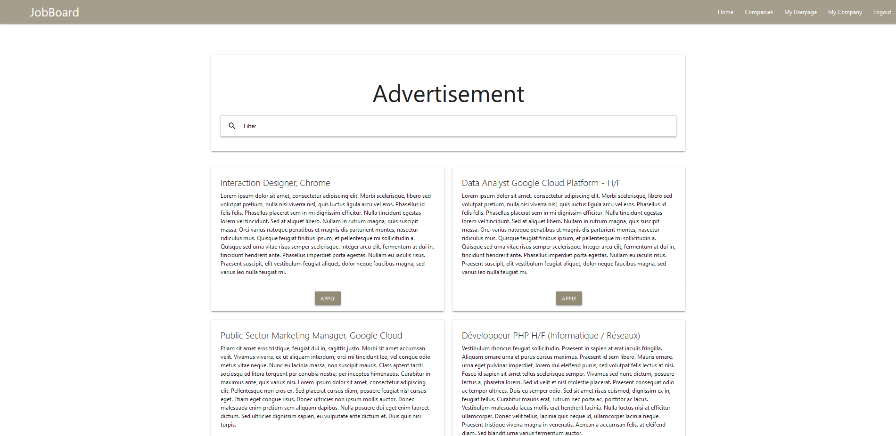
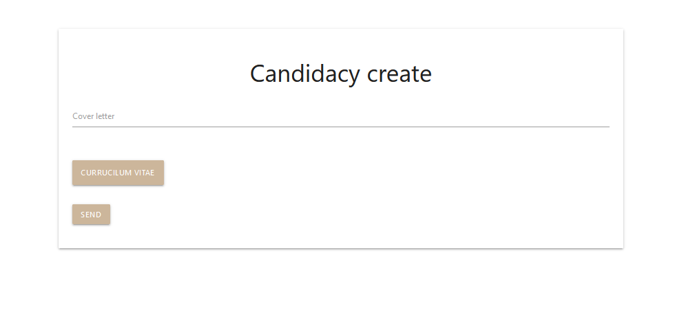
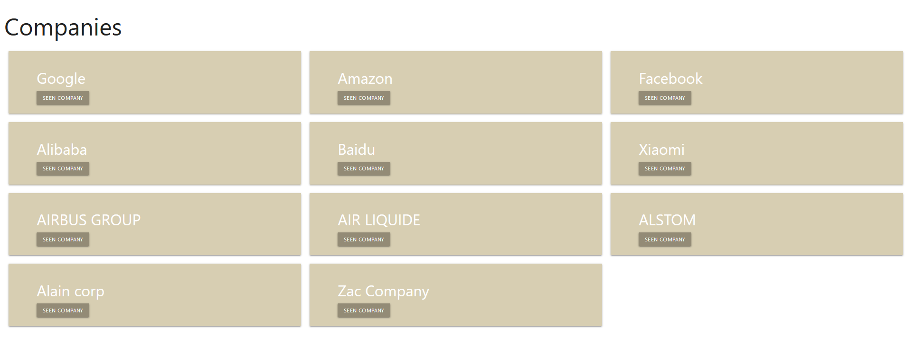
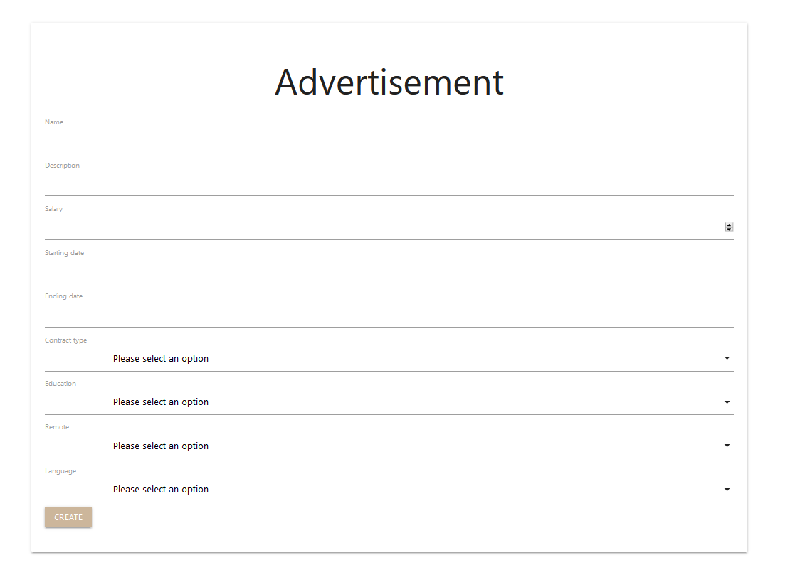
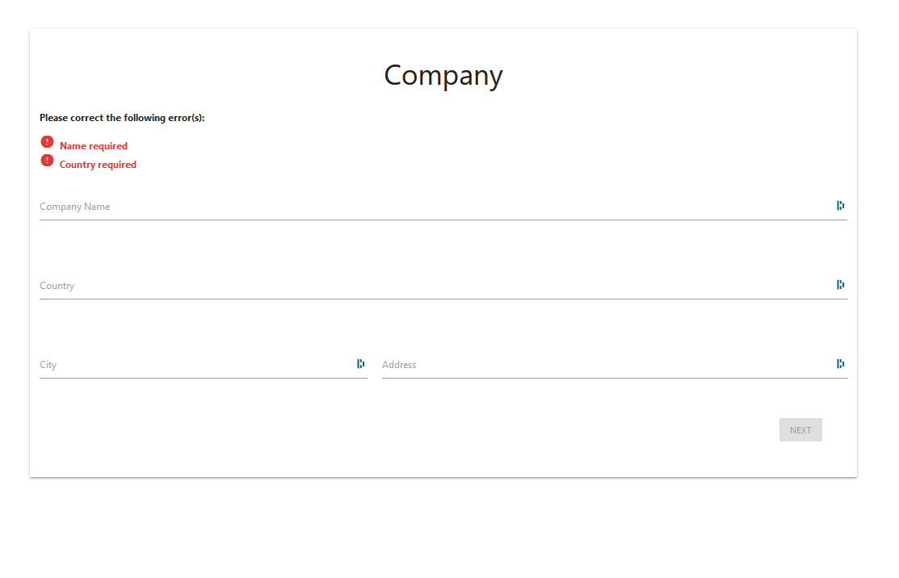
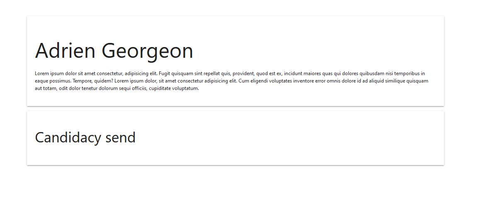

# Projet JobBoard avec Epitech

## Description
Création d'une plateforme de recherche d'emploi.
Cette plateforme permet de mettre en relation des chercheurs d'emploi avec des entreprises qui recherchent des salariés.
 
Ce projet a été réalisé avec les technologies MEVN. 
                                MongoDB, ExpressJS, VueJS, NodeJS 
Utilisation des frameworks : MaterializeCSS, Vuex, axios

## Quelque photo du projet
<h2>Page Accueil</h2>

<h2>Postuler une annonce sur la platefome</h2>

<h2>Visualisation des entreprises qui ont une annonce</h2>

<h2>Création d'une annonce</h2>

<h2>Création d'un profil d'entreprise</h2>

<h2>Dashboard d'un utilisateur avec sa description et ses annonces postulées</h2>

## Contributeurs
        Adrien GEORGEON, étudiant EPITECH
        Zachari Blinn, étudiant EPITECH